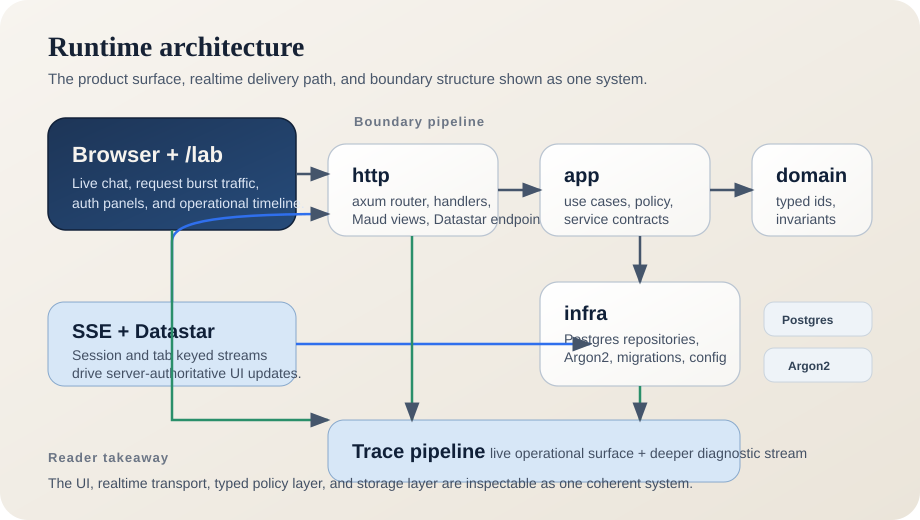

<div align="center">
  <picture>
    <source media="(prefers-color-scheme: dark)" srcset="./crates/http/static/eran.codes-dark.svg">
    
  </picture>
  <p><strong>A Rust portfolio application for secure backend systems, trust boundaries, and inspectable runtime behavior.</strong></p>
  <p>
    <a href="https://eran.codes">Live site</a>
    ·
    <a href="https://github.com/eboody/eran.codes">Source</a>
    ·
    <a href="./docs/README.md">Docs hub</a>
  </p>
  <p>
    <a href="https://github.com/eboody/eran.codes/actions/workflows/ci.yml"></a>
  </p>
</div>

# eran.codes

`eran_codes` is the Rust workspace behind my portfolio site at <https://eran.codes>.

This project is a working portfolio site and a place to show how I build secure backend systems in Rust.

Today the repo proves durable auth and session handling, encrypted sensitive-data storage, application-level key rotation, provider-token lifecycle, bounded background sync, explicit trust boundaries, typed contracts, and runtime surfaces that let a reviewer inspect behavior directly.



## What This System Demonstrates

- **Secure session posture.** `axum-login`, `tower-sessions`, Argon2, and Postgres-backed session storage are wired into the running app.
- **Encrypted sensitive-data handling.** Provider tokens and authorized record payloads are stored encrypted at rest, while reviewer-facing proof surfaces expose only redacted data until the authorized path is used.
- **Key custody evidence.** Ciphertext carries explicit key IDs, new writes use the active key, readable legacy keys keep old ciphertext decryptable, and bounded rotation passes re-seal stale ciphertext over time.
- **Bounded integration proof.** A local HTTP-backed stub provider, background token refresh, and periodic sync loops prove transport handling, token lifecycle, and sync-state behavior without claiming live third-party integrations.
- **Trust boundaries that stay explicit.** `http`, `app`, `domain`, and `infra` remain separate, so policy and mechanism do not blur together.
- **Inspectable runtime behavior.** Request metadata, backend flow, and live operational timelines are visible in the UI instead of hidden behind architecture prose.
- **Realtime delivery as supporting proof.** SSE + Datastar are used to make state changes and transport behavior observable, not as the whole thesis by themselves.
- **Typed contracts across the stack.** Maud components, domain newtypes and enums, and explicit workflow types keep rendering and business logic structured.

## Architecture Overview

```text
browser
  -> axum router + handlers
  -> app services
  -> domain types and invariants
  -> infra repositories + Postgres + Argon2

global SSE stream
  -> session/tab keyed registry
  -> Datastar patches for UI convergence

trace pipeline
  -> live operational surface for the reader
  -> deeper diagnostic stream for engineering visibility
```

At the crate-boundary level, the workspace stays intentionally layered:

```text
             browser
                |
                v
              http
    routing, handlers, SSE, Maud
                |
                v
               app
        use-case services
                |
                v
             domain
      types and invariants

infra supplies the Postgres, hashing, repository,
and session-backed runtime pieces used by the outer layers.
```

`[src/main.rs](./src/main.rs)` is the composition root. It wires:

- tracing
- Postgres-backed sessions
- app services
- the SSE registry
- the HTTP router

into one runtime.

## Observe The Current Proof Running

These pages expose runtime behavior directly in the UI.

| Surface | Path | What to observe |
| --- | --- | --- |
| Lab | [`/lab`](https://eran.codes/lab) | Auth/session posture, encrypted-storage proof, key-custody state, token lifecycle state, sync outcomes, request traces, and SSE transport in one place |
| Auth durability | [`/register`](https://eran.codes/register) -> [`/login`](https://eran.codes/login) -> [`/protected`](https://eran.codes/protected) | Session lifecycle, auth enforcement, and secure persistent sessions |
| Sensitive sync case | [`/work/sensitive-sync`](https://eran.codes/work/sensitive-sync) | Current shipped proof of encrypted-at-rest storage, key-versioned ciphertext, persisted sensitive-access grants, local HTTP boundary handling, bounded sync, denied reads, and audited authorized access |
| Supporting proof archive | [`/work`](https://eran.codes/work) | Archived chat, SSE, and operational case details collapsed into one supporting-proof surface |

While interacting, watch the operational timeline panel. It shows requests, commands, and state changes as they happen.

## Evaluate It In Five Minutes

1. Visit [`/lab`](https://eran.codes/lab).
   This is the quickest way to inspect the current proof surface: session-backed auth, encrypted storage, key-custody state, token lifecycle state, sync outcomes, typed boundaries, request traces, SSE transport, and live runtime behavior.

2. Run the auth/session path.
   - [`/register`](https://eran.codes/register)
   - [`/login`](https://eran.codes/login)
   - [`/protected`](https://eran.codes/protected)

3. Visit the focused proof surfaces.
   - [`/work/sensitive-sync`](https://eran.codes/work/sensitive-sync)
   - [`/work`](https://eran.codes/work)

4. Read the engineering rationale.
   - [Docs hub](./docs/README.md)
   - [Resume Realignment](./docs/resume-realignment.md)
   - [Sensitive Sync Architecture](./docs/sensitive-sync-architecture.md)
   - [Professionalism In Practice](./docs/professionalism-breakdown.md)
   - [Portfolio Demo Concepts](./docs/portfolio-demos.md)
   - [Auth + Sessions](./docs/auth-sessions.md)
   - [Tracing Plan](./docs/tracing.md)

5. Inspect the crate boundaries.
   - [domain](./crates/domain/README.md)
   - [app](./crates/app/README.md)
   - [infra](./crates/infra/README.md)
   - [http](./crates/http/README.md)

## Run It Locally

Required environment:
- `HOST`
- `PORT`
- `DATABASE_URL`
- `SESSION_SECRET` (`base64url`, no padding, 64 bytes)
- `DATA_ENCRYPTION_KEY` (`base64url`, no padding, 32 bytes) for the legacy single-key compatibility path

Keyring environment:
- `DATA_ENCRYPTION_KEYS_JSON` as a JSON array of `{ "key_id": "...", "key": "<base64url 32-byte key>" }`
- `ACTIVE_DATA_KEY_ID`
- `DISABLED_DATA_KEY_IDS` as an optional comma-separated list

Optional environment:
- `SESSION_CLEANUP_INTERVAL_SECS` (default `3600`)
- `INTEGRATION_TOKEN_REFRESH_INTERVAL_SECS` (default `900`)
- `INTEGRATION_SYNC_INTERVAL_SECS` (default `1200`)
- `ENCRYPTION_ROTATION_INTERVAL_SECS` (default `1800`)
- `ENCRYPTION_ROTATION_BATCH_SIZE` (default `25`)
- `INFRA_DB_MAX_CONNECTIONS` (default `10`)
- `LOG_FORMAT` (`pretty` or `json`)

Start the app:

```bash
docker-compose up -d
cargo run --bin with_db -- sqlx migrate run --source crates/infra/migrations
cargo run
```

Then open `http://127.0.0.1:3000/` or `http://127.0.0.1:3000/lab`.

## Codebase Map

| Area | Role | Start here |
| --- | --- | --- |
| [domain](./crates/domain/README.md) | Pure business types and invariants | `user` and `chat` modules |
| [app](./crates/app/README.md) | Use cases, policy, and external contracts | auth and chat services |
| [infra](./crates/infra/README.md) | Postgres, hashing, repositories, and migrations | auth repo, chat repo, config |
| [http](./crates/http/README.md) | Router, handlers, SSE, Maud views, component surfaces, and trace surfaces | router, handlers, views, `trace_log` |
| [utils](./crates/utils/README.md) | Small shared helpers and developer tooling | `visual_snapshot` and support utilities |

## Read The System Like This

- **Start at the docs hub**
  - [docs/README.md](./docs/README.md)

- **Why the thesis is shifting**
  - [Resume Realignment](./docs/resume-realignment.md)
  - [Sensitive Sync Architecture](./docs/sensitive-sync-architecture.md)

- **Why it is structured this way**
  - [Professionalism In Practice](./docs/professionalism-breakdown.md)
  - [Project Audit](./docs/project-audit.md)
  - [Refactor Plan](./docs/refactor-plan.md)

- **What the current proof surface actually shows**
  - [Auth + Sessions](./docs/auth-sessions.md)
  - [Sensitive Sync Architecture](./docs/sensitive-sync-architecture.md)
  - [Tracing Plan](./docs/tracing.md)
  - [Portfolio Demo Concepts](./docs/portfolio-demos.md)

- **How the HTTP surface is organized**
  - [HTTP crate](./crates/http/README.md)
  - [HTTP internals](./crates/http/src/README.md)
  - [Handlers](./crates/http/src/handlers/README.md)
  - [Views](./crates/http/src/views/README.md)

## Design Principles

This repo favors:
- explicit boundaries over convenience coupling
- typed invariants over stringly state
- visible runtime behavior over hidden magic
- reusable render components over template duplication
- clear composition roots over implicit wiring

Those tradeoffs are consistent across the codebase.
